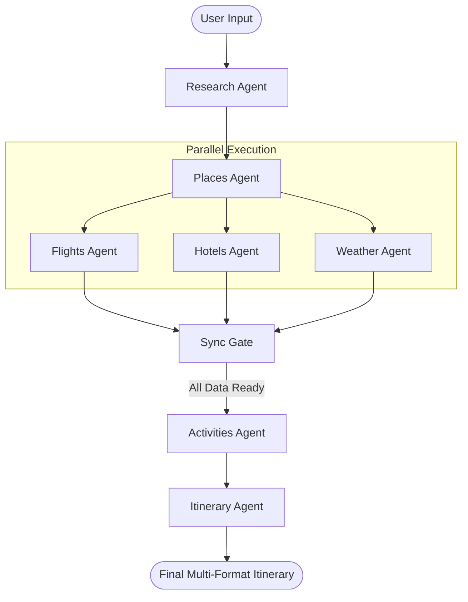

# 🌍 Voyager-Agents

Voyager-Agents is an enterprise-ready **Multi-Agent AI Travel Orchestrator** designed to create high-fidelity, personalized travel itineraries. Powered by **LangGraph**, **Google Gemini**, and **FastAPI**, it coordinates a team of specialized agents to perform real-time research and planning.

---

## 🚀 Key Features

- 🤖 **Multi-Agent Orchestration**: Powered by **LangGraph** for flexible, stateful decision-making.
- 🔍 **Real-Time Intelligence**: Seamless integration with **Tavily** and **Wikipedia** for up-to-date travel data.
- ✈️ **Comprehensive Planning**: Automated research for flights, hotels, weather, and local attractions.
- 📄 **Professional Exports**: Generate beautiful, print-ready PDF itineraries.
- 🌐 **Modern Architecture**: High-performance **FastAPI** backend coupled with a responsive **Next.js** frontend.

---

## 🏗️ Technical Architecture

The system employs a sophisticated multi-agent workflow:



- **Research Agent**: Collects foundational destination intelligence.
- **Specialized Agents**: Handle parallel lookups for logistics and environment.
- **Sync Gate**: Ensures data consistency before final synthesis.
- **Itinerary Agent**: Compiles all verified data into a cohesive, professional travel plan.

---

## 🛠️ Tech Stack & Integration Details

- **Backend**: **FastAPI** provides a robust, asynchronous entry point for the frontend, while **LangGraph** manages the complex state and transitions of the multi-agent system.
- **Frontend**: A sleek **Next.js** interface built with **Tailwind CSS**, featuring dynamic forms and real-time status updates from the AI agents.
- **AI Intelligence**: Leveraging **Gemini 2.5 Flash** for ultra-fast reasoning and high-fidelity itinerary generation.
- **Research Tools**:
  - **Tavily AI**: Optimized for LLM-based web search, providing clean, relevant travel data.
  - **Wikipedia API**: Supplies rich historical and cultural context for destinations.
  - **Google Maps**: (Optional) Used for precise location data and distance calculations.
- **Output Engine**: **ReportLab** and **Markdown-PDF** transform the digital itinerary into professional, printable PDF documents.
- **State & Communication**: **Redis** for efficient state management and session tracking across the multi-agent workflow.

---

## 🗺️ Roadmap & Future Enhancements

We are actively working on expanding Voyager-Agents beyond research and planning. Our upcoming milestones include:

### 📱 1. Omnichannel Communication
- **WhatsApp Integration**: Receive your final itinerary directly on WhatsApp.
- **Twilio SMS**: Status updates and emergency contact details sent via SMS.
- **Real-time Notifications**: Instant alerts for flight changes or weather warnings during your trip.

### 💳 2. Real-Time Booking Engine
- **Direct Bookings**: Integration with Amadeus or Skyscanner APIs to book flights and hotels directly through the app.
- **Secure Payments**: Specialized Payment Agent to handle secure transaction workflows.

### 💰 3. Budget-Friendly Intelligence
- **Cost Optimizer Agent**: A dedicated agent to scan for the best deals and suggest cheaper alternatives (e.g., hostels vs. hotels, public transport vs. cabs).
- **Expense Tracking**: Live tracking of trip expenses against the set budget.

### 🌍 4. Advanced Personalization
- **Multi-Language Support**: Itineraries generated in the user's native language.
- **Community Templates**: Share and discover successful itineraries from other travelers.

---

## 📦 Installation & Setup

### 1. Prerequisites
- Python 3.10+
- Node.js & npm (for frontend)
- API Keys: Google Gemini (AI Studio), Tavily, and optionally Google Maps.

### 2. Backend Setup
```bash
cd backend
python -m venv venv
# Windows:
.\venv\Scripts\activate
# Linux/Mac:
source venv/bin/activate

pip install -r requirements.txt
```

### 3. Frontend Setup
```bash
cd frontend
npm install
```

### 4. Configuration
Create a `.env` file in the root directory (or respective subfolders):
```ini
GOOGLE_API_KEY="your_api_key"
TAVILY_API_KEY="your_api_key"
# Optional for additional features:
GOOGLE_MAPS_API_KEY="your_api_key"
GMAIL_USER="your_email@gmail.com"
GMAIL_APP_PASSWORD="your_app_password"
```

---

## ▶️ Running the Application

### Start the Backend
```bash
cd backend
uvicorn app.main:app --reload
```
*Note: Ensure your FastAPI entry point matches your file structure.*

### Start the Frontend
```bash
cd frontend
npm run dev
```

The application should now be accessible at `http://localhost:3000`.

---

## 📜 License
This project is licensed under the MIT License.

## ✨ Credits
Built with ❤️ using [LangGraph](https://github.com/langchain-ai/langgraph) and [Google Gemini](https://ai.google.dev/).
