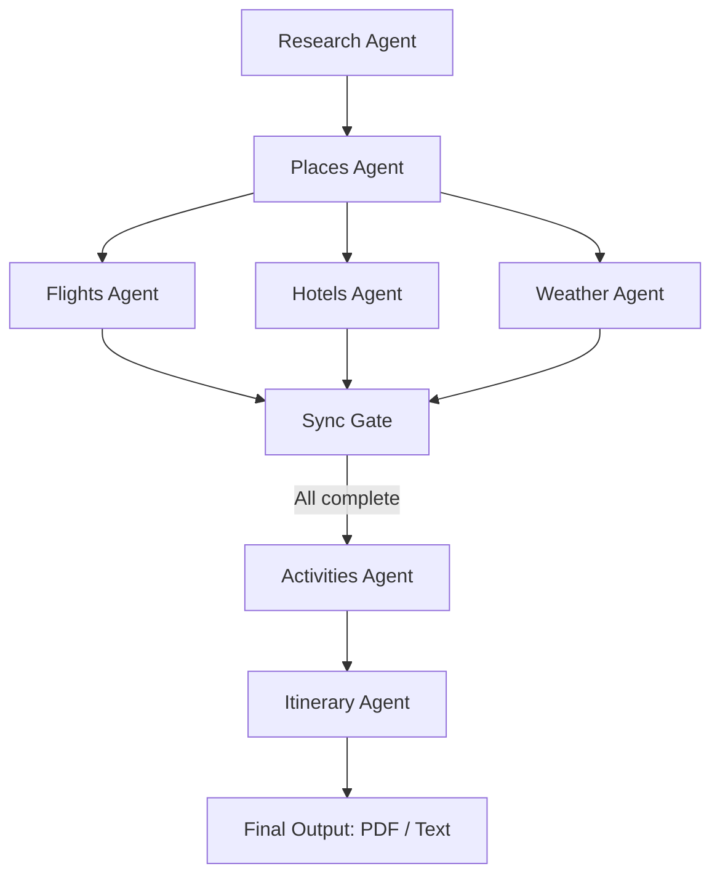

# 🌍 Voyager-Agents

An enterprise-ready **Multi-Agent AI Travel Orchestrator** powered by **LangGraph**, **Google Gemini**, and **FastAPI**. This system coordinates specialized agents to design high-fidelity, personalized travel itineraries with real-time research.

---

## 🚀 Features
- 🤖 **Multi-Agent Orchestration** using LangGraph for complex decision-making.
- 🔍 **Real-Time intelligence** via Wikipedia and Tavily search integration.
- 🌦️ **Dynamic Weather Integration** for destination-specific planning.
- ✈️ **Smart Recommendations** for flights, hotels, and local activities.
- 📋 **Automated Itinerary Generation** with full day-by-day scheduling.
- 📄 **Professional PDF Export** for offline travel convenience.

---

## 🖼️ Screenshots

### Workflow Diagram


### App UI
<p align="center">
  
  
</p>

<p align="center">
  
  
</p>

---

## 📦 Installation

### 1. Clone the repository
```bash
git clone https://github.com/yourusername/voyager-agents.git
cd voyager-agents
```

### 2. Create a Python environment (Python 3.10 recommended)
```bash
python -m venv .venv
source .venv/bin/activate   # On Linux/Mac
.venv\Scripts\activate      # On Windows
```

### 3. Install dependencies
```bash
pip install -r requirements.txt
```

---

## 🔑 API Keys Setup

The app requires **Google Gemini** and **Tavily** credentials.

### Create a `.env` file in the project root:
```ini
GOOGLE_API_KEY="your_google_gemini_api_key"
TAVILY_API_KEY="your_tavily_api_key"
```

---

## ▶️ Run the App

```bash
streamlit run app.py
```

The app will launch in your browser (default: `http://localhost:8501`).

---

## 📚 Tech Stack
* **LangGraph** → Multi-agent orchestration layer.
* **Google Gemini API** → Advanced LLM for reasoning and content generation.
* **Tavily API** → Real-time web search for travel data.
* **FastAPI** → High-performance backend service.
* **Next.js / Streamlit** → Modern, responsive UI components.
* **ReportLab** → Professional PDF generation engine.

---

## ✅ Example Workflow


1. **Research Agent** → Collects foundational destination intelligence.
2. **Parallel Agents** → Flights, Hotels, and Weather agents execute concurrently.
3. **Sync Gate** → Synchronizes parallel outputs for consistency.
4. **Itinerary Agent** → Compiles all data into a cohesive, professional plan.

---

## 🚧 In Progress
- [ ] Integration with real-time flight booking APIs.
- [ ] User authentication and saved trip history.
- [ ] Multi-language support for international itineraries.
- [ ] Advanced budget optimization algorithms.

---

## 📜 License
MIT License – free to use and modify for professional or personal use.

---

## ✨ Credits
Built with ❤️ using [LangGraph](https://github.com/langchain-ai/langgraph), [Google Gemini](https://ai.google.dev/), and [Tavily](https://tavily.com/).
